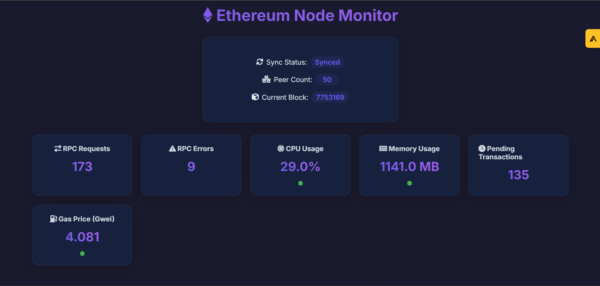

# NodeBeat

A simple, clean dashboard to watch your Ethereum node's health in real-time.

## Dashboard Preview


*Real-time monitoring of node status, network peers, block height, gas prices, and system metrics*

## Why?

Running an Ethereum node is hard. You need to watch many things at once:
- Is my node synced?
- How many peers am I connected to?
- Is my node using too much CPU or memory?
- Are there any errors?

Current solutions are either:
- Too complex to set up
- Need multiple tools
- Use too many resources
- Don't show information in real-time

NodeBeat fixes this by giving you one simple dashboard that shows everything you need to know about your node's health, right in your browser.

## Quick Start

1. Make sure you have Node.js installed
2. Run these commands:
```bash
git clone https://github.com/sivaratrisrinivas/nodeBeat.git
cd nodeBeat
npm install
node server.js
```
3. Open http://localhost:3000 in your browser

That's it! You'll see your node's stats updating in real-time.

## Usage

### What You'll See
- Sync Status: Whether your node is up to date with the network
- Peer Count: How many other nodes you're connected to
- Block Number: Latest block your node has processed
- Gas Price: Current network transaction fee
- CPU & Memory Usage: How much resources your node is using
- RPC Stats: Number of requests and any errors

### Understanding the Colors
- 🟢 Green: Everything is good
- 🟡 Yellow: Something needs attention
- 🔴 Red: Immediate action needed

### Customizing
Want to change how things look or work? Edit these files:
- `server.js`: Change how often data updates or which network to connect to
- `public/script.js`: Adjust warning levels for metrics
- `public/style.css`: Change colors and layout

### Using Your Own Node
By default, NodeBeat uses Alchemy's public node. To use your own:
1. Get an API key from [Alchemy](https://www.alchemy.com/)
2. Open `server.js`
3. Replace the API key with yours

## Contributing

We'd love your help making NodeBeat better! Here's how:

1. Fork the project
2. Create your feature branch (`git checkout -b cool-new-feature`)
3. Make your changes
4. Test everything works
5. Commit your changes (`git commit -m 'Added a cool feature'`)
6. Push to your branch (`git push origin cool-new-feature`)
7. Open a Pull Request

### What We'd Love Help With
- Adding more node metrics
- Making the UI even better
- Adding alerts when things go wrong
- Supporting more Ethereum clients
- Writing better documentation

## License

MIT - which means you can do pretty much anything with this code. See [LICENSE](LICENSE) for details.